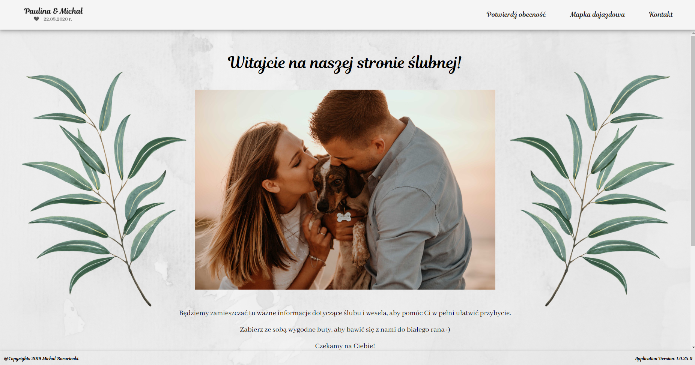

# Wedding Web

Application build for the purpose of my own wedding over time evolved into small training project, where I can try and test new technologies.

## Build Status

| Application | Build Status |
|-------------|--------------|
| WeddingWeb |  | 

## Technology involved

The aim of the project is to test and learn the latest technology. Some of those currently used:

- .NET Core 3.1
- Angular 11
- Azure
- Terraform

## Getting Started

### Visual Studio (F5 experience)

- clone repository
- open project in Visual Studio
- run project

## Architecture overview

TODO: provide the architecture diagram

## Development

The branching strategy follows the [GitHub Flow](https://guides.github.com/introduction/flow/)

- `master`: Contains the latest stable code, all PRs must be against it.

Any other branch is considered temporary and could be deleted at any time.

### Renew TLS/SSL certificate

Please follow [the instruction](infrastructure/cert/renew-certificate.md) to be able to renew certificate.

## Future plans

- introduce terraform
- gallery with authentication via AAD
- video share with authentication via AAD
- separate apps
- containerize apps
- introduce automatic TLS/SSL cert renewal
