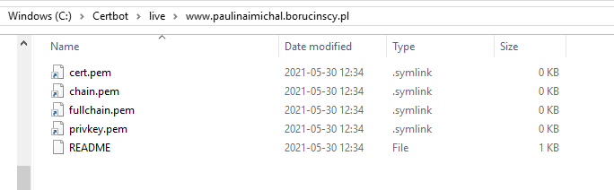
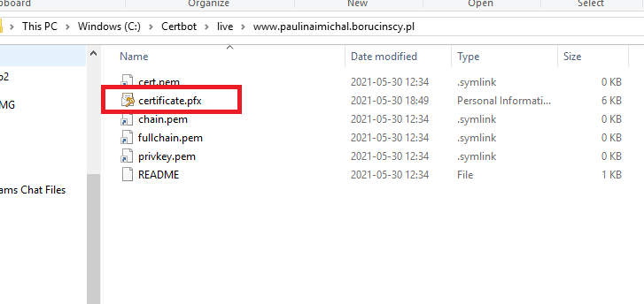

# TLS/SSL Certificate

## Request for certificate

There is multiple option of requesting certificate. For the purpose of this project I am using the free TLS/SSL cert provider called <https://letsencrypt.org/>. Most commands are created for powershell on windows but you should be able to achieve the same on other platform.

### Install certbot

Get into the <https://certbot.eff.org/> and download certbot for your OS from the instruction page.

### Generate certificate files

Open powershell console with and admin rights, run bellow command and respond to all questions.

```powershell
certbot certonly -d www.paulinaimichal.borucinscy.pl --manual --preferred-challenges dns 
```
Go to `C:\Certbot\live\www.paulinaimichal.borucinscy.pl` following files should be generated.



Go to the cert folder.

```powershell
cd C:\Certbot\live\www.paulinaimichal.borucinscy.pl
```

Create private pkcs12 certificate using openssl. Openssl.exe should be in the git folder.

```powershell
start "C:\Program Files\Git\usr\bin\openssl.exe"
```

Prepare password for the pkcs12 certificate and save it for later upload.
In the newly open window run the bellow command (provide prepared password) and generate certification.pfx file.

```powershell
pkcs12 -export -out certificate.pfx -inkey privkey.pem -in cert.pem -certfile chain.pem
```

Certificate should looks like bellow.



### Upload to the KeyVault

- Login to the <portal.azure.com>
- Import the certificate into the Key Vault.
- Go to the App Service -> TLS/SSL settings tab -> Private Key Certificates and import cert from the Key Vault.

## Credits

Thanks for great blog post about how to make it work which you can find here - [Securing your Azure Web App with Let's Encrypt](https://dev.to/ope/securing-your-azure-web-app-with-let-s-encrypt-4g99).

## Worth reviewing & future options

Certificate has to be renewed every 3 months, there is an option to automate that process more information about how to do it can be found here - <https://letsencrypt.org/docs/client-options/>
